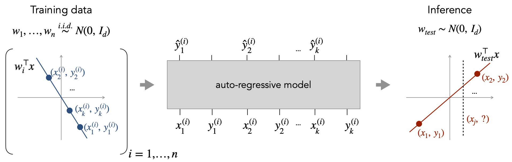

This repository contains the code and models for our paper:

**What Can Transformers Learn In-Context? A Case Study of Simple Function Classes** <br>
*Shivam Garg\*, Dimitris Tsipras\*, Percy Liang, Gregory Valiant* <br>
Paper: http://arxiv.org/abs/2208.01066 <br><br>

This repository adapts the Garg et al. setup for our CS 182 project, focusing on linear and quadratic in-context learning. The project code and experiments here were written by Nils Valseth Selte, Dagny Streit, Justin Lee, and Hanna Rod.



```bibtex
    @InProceedings{garg2022what,
        title={What Can Transformers Learn In-Context? A Case Study of Simple Function Classes},
        author={Shivam Garg and Dimitris Tsipras and Percy Liang and Gregory Valiant},
        year={2022},
        booktitle={arXiv preprint}
    }
```

## Getting started
You can start by cloning our repository and following the steps below.

1. Install the dependencies for our code using Conda. You may need to adjust the environment YAML file depending on your setup.

    ```
    conda env create -f environment.yml
    conda activate in-context-learning
    conda install "mkl<2024"
    ```

2. Download [model checkpoints](https://github.com/dtsip/in-context-learning/releases/download/initial/models.zip) and extract them in the current directory.

    ```
    wget https://github.com/dtsip/in-context-learning/releases/download/initial/models.zip
    unzip models.zip
    ```

3. [Optional] If you plan to train, populate `conf/wandb.yaml` with you wandb info.

That's it! You can now explore our pre-trained models or train your own. The key entry points
are as follows (starting from `src`):
- The `eval.ipynb` notebook contains code to load our own pre-trained models, plot the pre-computed metrics, and evaluate them on new data.
- `train.py` takes as argument a configuration yaml from `conf` and trains the corresponding model. You can try `uv run python train.py --config conf/toy.yaml` for a quick linear run, or `uv run python train.py --config conf/toy-quadratic.yaml` for a quadratic toy run.
- `run_sweep.sh` trains three GPT-2 sizes on linear regression (`conf/linear_sweep/*`).
- `run_sweep_curriculum.sh` trains linear+quadratic dual curricula (`conf/dual_sweep/*`).
- `run_dual_eval.py` sweeps A/B context lengths for the dual-task checkpoints and writes CSVs to `src/results/`.

If you prefer not to use `uv`, activate your environment and replace `uv run python ...` with `python ...`.

## Linear ↔ Quadratic A/B Study
We added scripts to probe how transformers transfer between linear and quadratic functions under different curricula.

**Training**
- Single baseline dual run: from `src/`, `uv run python train.py --config conf/training_dual_task.yaml` (`training.problem_type: dual`, `curriculum_type: random`).
- Curriculum sweeps: `bash run_sweep_curriculum.sh` trains sequential, mixed, and random dual curricula (checkpoints in `models/dual_*`).
- Linear-only baselines: `bash run_sweep.sh` runs the three linear regression configs in `conf/linear_sweep/`.

**Evaluation**
- After training, set the run IDs in `src/run_dual_eval.py`'s `models` dict and run `uv run python run_dual_eval.py`.
- The script evaluates both orders (linear context → quadratic query, and vice versa) across A/B context lengths, saving mean/SEM CSVs under `src/results/`.

# Maintainers
* [Shivam Garg](https://cs.stanford.edu/~shivamg/)
* [Dimitris Tsipras](https://dtsipras.com/)
